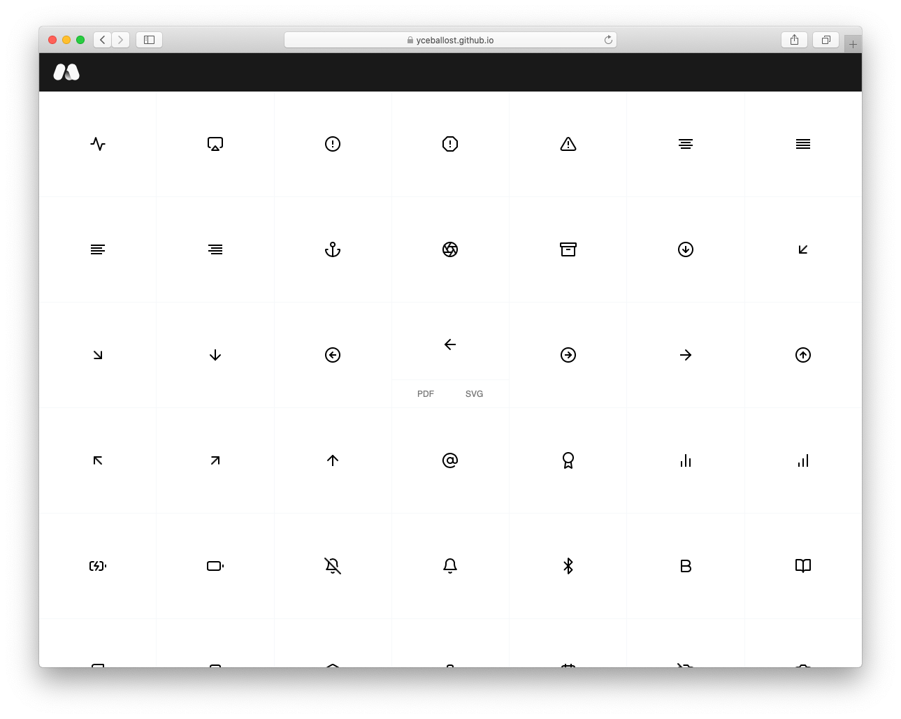

Build a dynamic icon repository in Github Pages

  <a href="https://yceballost.github.io">Live preview</a>

  
## Installation
This is a copy of this [Jekyll project](https://github.com/barryclark/jekyll-now). In this link you have more information about how to install Jekyll and manage the files with Jekyll.

## How it's works
1. Rename your repo to `[GITHUB_USERNAME].github.io`
2. Just put your icons in `icn_export` folder.
  - Only available .svg and .pdf icons (it is quite easy to change the code to allow other formats)
  - Folder inside icn_export folders doesn't affect to the grid
3. Go to your site => `[GITHUB_USERNAME].github.io`

## Improvements (a lot xD)
- Something to manage categories
- Icon tagging
- Search bar
- Filters
- Possibility to change the color and download

I am using [feather icons](https://feathericons.com/)
